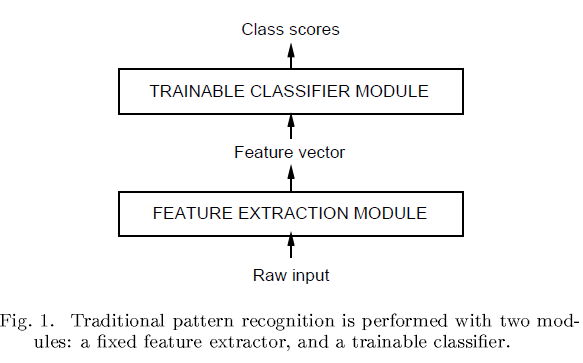
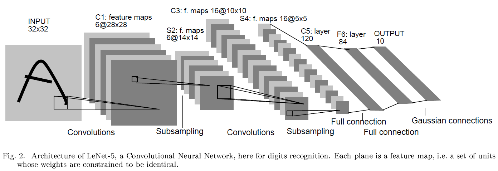
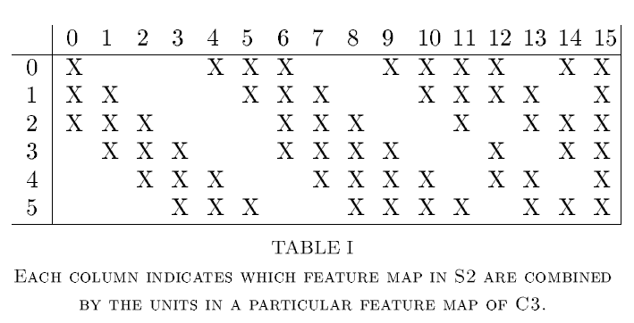
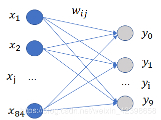
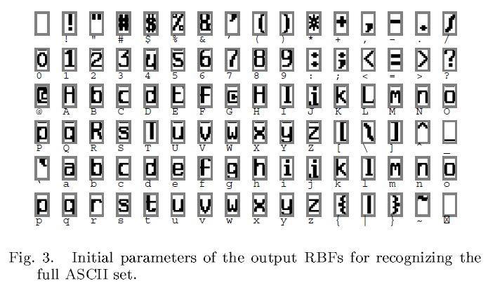

# Gradient-Based Learning Applied to Document Recognition
## 笔记：codingleee@163.com

## I. Introduction  
传统的模式识别分为两部分(如图1)：
- 特征提取器(feature extractor)  
  The first module, called the feature extractor, transforms the input patterns so that they can be represented by low-dimensional vectors or short strings of symbols that (a) can be easily matched or compared, and (b) are relatively invariant with respect to transformations and distortions of the input patterns that do not change their nature.  
  人工的、带有先验知识的去从输入中提取特征形成低维向量
- 分类器(classifier)  
  The classifier, on the other hand, is often general-purpose and trainable.  
  分类器是通用的、可训练的。

传统方法的主要问题是：
- 识别的准确率很依赖与人工地特征选择
- 针对特定任务要选择不同的特征

然而在当时由于：
- 计算机计算能力提高；
- 像手写数字等数据库带来了大量数据；
- 新的机器学习技术的发展；  

使得使用反向传播算法的多层神经网络开始得以应用。

### A. Learning from data  
区分开训练集上的loss和测试集上的loss，找到合适的参数W使得系统的结构风险最小化(structural risk minimization)

### B. Gradient-Based Learning
提出使用随机梯度下降法来更新参数  

### C. Gradient Back-Propagation
- 局部最小值(local minima)问题在实践中不会对多层神经网络带来很大影响
- 反向传播算法是最广泛使用的神经网络学习算法

### D. Learning in Real Handwriting Recognition Systems
建立手写识别系统的主要难点之一是识别的不说单个字符而是连续的句子，因此如何从相邻的单词或句子中分割出来字符是一个问题。  
一个解决方法是使用GTN网络，通过卷积层可以有效降低它的计算工作量。

### E. Globallt Trainable System
传统的模式识别系统由多模块组成，例如一个文档识别器要有定位器(field locator，定位感兴趣区域)、分割器(field segmenter，分割单词)、识别器(recognizer, 识别字符)以及文本处理器(contextual post-processor,根据语法选择最佳候选答案)  
缺点：慢(suboptimal)，需人工调优   
作为替代，设计一个包含参数W的系统，参数W对于损失E可微，以及系统内部的参数W几乎处处可微，这样就可以使用基于梯度的方法来更新参数优化系统。

## II. CONVOLUTIONAL NEURAL NETWORKS FOR ISOLATED CHARACTER RECOGNITION
与手动的从图片中选择特征相比，更好的方法是让特征提取器(feature extractor)自己从原始输入学习出更好的特征。  
传统的全连接网络的不足：
1. 由于原始输入往往有大量变量（比如像素），全连接网络将会带来大量网络参数，给学习带来困难;  
2. - 非结构化网络对于输入没有平移或旋转不变性.(The main deficiency of unstructured nets for image or speech applications is that they have no built-in invariance with respect to translations, or local distortions of the inputs.)  
   - 由于字符大小、位置、书写风格等问题会导致特征位置的变化.(cause variations in the position of distinctive features in input objects)  
   -  原则上讲足够大的网络能够学习到这种变化，但是会导致为了捕获不同位置的特征，相似的权重单元重复出现在不同的位置(such a task would probably result in multiple units with similar weight patterns positioned at various locations in similar weight patterns positioned at various locations in appear on the input.) 
3. 全连接的网络的另一个缺点就是完全忽略了输入的拓扑结构,然而图像具有很强的二维局部结构，空间相邻的像素具有高度相关性。

### A. Convolutional Networks
卷积网络结合了3个架构设计特点来保证一定程度上的平移、尺度和旋转不变性（shift，scale and distortion invariance）：

- 局部感受野（local receptive fields）
- 权重共享（weight sharing）
- 空间下采样（spatial sub-sampling）

使用局部感受野，卷积层的神经元可以提取图像中的初级视觉特征（elementary visual features）比如有向边（oriented edges），端点（end-points）和角点（corners）。这些特征可被随后的卷积层进一步组合形成更高级的特征。  

像之前提到的，由于图片的平移或旋转会导致同一特征可能会出现在输入的不同位置。因此，在某个位置的初级特征提取器可能在输入空间的其他位置也会起到作用。可以通过固定一组神经网络单元的参数（也就是卷积核）来实现这一功能。
In addition, elementary feature detectors that are useful on one part of the image are likely to be useful across the entire image. This knowledge can be applied by forcing a set of units, whose receptive fields are located at different places on the image, to have identical weight vectors.  

一层中的所有神经元形成成一个平面，在这一层中的所有单元共享相同的参数权重。神经元的所有输出构成一个特征图。
Units in a layer are organized in planes within which all the units share the same set of weights. The set of outputs of the units in such a plane is called a feature map. 

一个完整的卷积层是由多个特征图组成的（每个特征图对应于上一层的一种权重向量（卷积核）），每个特征图即是对上一层的一种特征的提取结果，因此多个特征图表示的是提取出的多种特征。  
A complete convolutional layer is composed of several feature maps(with different weight vectors), so that multiple features can be extracted at each location.  
All the units in a feature map share the same set of 25 weights and the same bias so they detect the same feature at all possible locations on the input. The other feature maps in the layer use different sets of weights and biases,thereby extracting different types of local features. 

卷积层的一个重要特性是如果输入图像发生了位移，特征图会发生相应的位移，否则特征图保持不变。这个特性是CNN对位移和形变保持鲁棒的基础。  
An interesting property of convolutional layers is that if the input image is shifted, the feature map output will be shifted by the same amount, but will be left unchanged otherwise. This property is at the basis of the robustness of convolutional networks to shifts and distortions of the input.

一旦计算出特征图,那么特征的精确的位置就变得不重要了，不同特征之间的相对位置才是需要关注的。比如，我们知道左上方区域有一个水平线段的一个端点，右上方有一个角，下方垂直线段有一个端点，我们就知道这个数字是7。这些特征的精确位置不仅对识别没有帮助，反而不利于识别，因为对于不同的手写字符实例，字符的绝对位置会经常变动。

在特征图中降低特征的位置的精度的方式是降低特征图的空间分辨率，这个可以通过下采样层达到，下采样层通过求局部平均降低特征图的分辨率，并且降低了输出对平移和形变的敏感度。  
This can be achieved with a so-called sub-sampling layers which performs a local averaging and a sub-sampling, reducing the resolution of the feature map, and reducing the sensitivity of the output to shifts and distortions. 

LeNet-5中的第二个隐藏层就是下采样层。这个层包含了6个特征图，与前一层的6个特征图对应。每个神经元的感受野是2x2,每个神经元计算四个输入的平均，然后乘以一个系数，最后加上一个偏执，最后将值传递给一个sigmoid函数。相邻的神经元的感受野没有重叠。因此，下采样层的特征图的行和列是前一层特征图的一半。系数和偏置影响了sigmoid函数的效果。如果系数比较小，下采样层相当于对输入做了模糊操作。如果系数较大，根据偏置的值下采样层可以看成是“或”或者“与”操作。卷积层和下采样层是交替出现的，这种形式形成一个金字塔：每一层，特征图的分辨率逐渐减低，而特征图的数量逐渐增加。

逐步降低空间分辨率（下采样）以及逐步增加特征表示的丰富度（增加特征图数量）可以大大提高网络对几何变换的不变性。  
A large degree of invariance to geometric transformations of the input can be achieved with this progressive reduction of spatial resolution compensated by a progressive increase of the richness of the representation (the number of feature maps). 

使用权重共享的策略可以大大减小模型参数数量，减小了测试误差和训练误差之间的差距(防止模型过拟合)
The weight sharing technique has the interesting side effect of reducing the number of free parameters, thereby reducing the “capacity” of the machine and reducing the gap between test error and training error.

### B. LeNet-5

图像的输入是32x32的尺寸，但其中字符区域一般占据居中位置的20x20的大小，将图像扩边到32x32的一个主要目的是考虑到最后的卷积层（最高级的特征检测器）可以检测到字符边界的特征信息如角点、端点等。这其实相当于考虑到了卷积网络的有效感受野，如果图像目标的特征太靠近图像边界，到最高级的feature map层时，最边上的特征可能已经丢失掉了。  

为了加速训练，输入图像全部被归一化为均值=0，方差=1。

C1是卷积层，包含6个28x28的feature map，kernel=5x5，stride=1，没有padding，C1层包含5x5x6+6=156个可训练参数；

S2是下采样层，包含6个14x14的feature map，kernel=2x2，stride=2，这里的下采样操作类似于平均池化（average pooling），不过包含可训练的层参数：每一个输出unit=W*(S11+S12+S21+S22)+Bias，即对应4个输入unit的值相加，乘以一个可训练的权重W，再加上一个可训练的偏置Bias。因此S2层包含6x2=12个可训练参数；

C3是卷积层，包含16个10x10的feature map，kernel=5x5，stride=1，没有padding，C3层包含5x5x(3x6+4x9+6x1)+16=1516个可训练参数。  
注意C3层中每一个feature map并不由S2中所有6个feature map产生，每一个输出的feature map只由C2层中特定的几个fature map作为输入，具体对应关系如下表(比如C3第0层使用了S2第0、1、2层，C3第10层使用了S2第0、1、4、5层)：

为什么不将S3中的每一个feature map连接到C2中的所有特征层呢？  
1. 非完全的连接方式减小了一部分网络连接数量，控制模型的连接数量。
2. 这种设计试图打破网络的对称性，S3层中不同的feature map被迫去提取C2层中不同的特征，因为它们获得了不同的输入；

S4是下采样层，包含16个5x5的feature map，kernel=2x2，stride=2，具体实施方式和C2层相同，S2层包含16x2=32个可训练参数；

C5是卷积层，包含120个1x1的feature map，kernel=5x5，因为S4的大小就是5x5，因此C5相当于一个全连接层，C5层包含5x5x16x120+120=48120个可训练参数；

F6是全连接层；包含84个unit，F6层包含120x84+84=10164个可训练参数，激活函数是tanh；  

输出层包含10个unit，使用的是欧几里得距离的径向基函数（RBF）。  
每个RBF单元的输出y_i由以下公式计算：  
  
也就是说每个RBF单元的输出是输入向量（F6层）和参数向量（F6-OUTPUT）之间的距离（根据这个公式和下面的位图来说应该是正确识别的分类输出值最小，我是这么认为的..），X、Y和W的关系如下图所示：
  
  

从概率的角度考虑，RBF的输出可以看做F6层空间中高斯分布的非标准化负对数似然。  
In probabilistic terms, the RBF output can be interpreted as the unnormalized negative log-likelihood of a Gaussian distribution in the space of configurations of layer F6. 

F6到OUTPUT的参数向量的值是由人工设定的并且保持固定不变。  
The parameter vectors of these units were chosen by hand and kept fixed (at least initially).  
参数向量的初始值如下图所示，每个参数向量被表示为7*12的位图（共84个参数），每个位图代表对应的ASCII编码，其中的值被设置+1和-1。

   

### C. Loss Function
最基础的损失函数就是根据最大似然估计的最小均方差（MSE）:

   

其中P表示样本数，后面的求和项里面的值表示每个样本标签（即真实结果）对应的RBF单元的输出值（其实上面讲到的RBF单元就是F6层和F6-OUTPUT之间参数的误差平方，最小化标签对应的RBF unit输出结果就是让F6层的值向真实的结果之间靠近）

如果允许RBF的参数更新，也就是F6-OUTPUT之间的参数更新，那么一种难以接受的结果就是该层的参数全部变成相同的向量，而且F6层的值等于该向量，那么最后的输出恒为0（相同向量之间的距离为0），不管输入是什么。这个问题的一个解决办法就是冻结RBF的参数，不让它更新。  
First, if we allow the parameters of the RBF to adapt, E(W) has a trivial, but totally unacceptable, solution. In this solution, all the RBF parameter vectors are equal, and the state of F6 is constant and equal to that parameter vector. In this case the network happily ignores the input, and all the RBF outputs are equal to zero. This collapsing phenomenon does not occur if the RBF weights are not allowed to adapt. 

### 后续..
第三章讲述了训练的一些细节以及与其他方法的对比，还介绍了LeNet-4和Boosted LeNet-4，后面的内容就没动力看下去了...  
LeNet-5可以说是接触到的最早的CNN结构网络，单说网络本身最令我迷惑的就是最后一层的RBF unit，然而网上的代码几乎全是替换成了全连接+softmax。

参考：  
https://www.jianshu.com/p/fc2fa28d3b91  
https://blog.csdn.net/sunshine_010/article/details/79876255
https://blog.csdn.net/weixin_42398658/article/details/84392845
