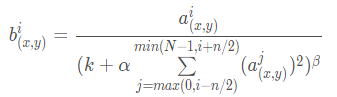
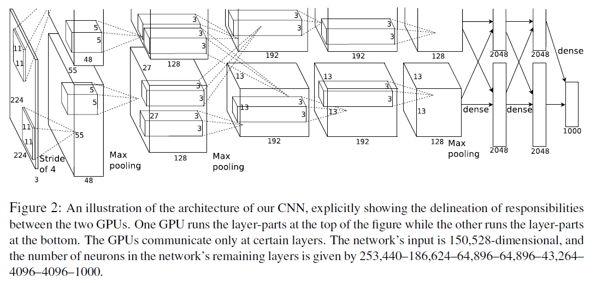

# ImageNet Classification with Deep Convolutional Neural Networks (AlexNet)
笔记：codingleee@163.com  

AlexNet是Hinton和他的学生Alex Krizhevsky设计的,在ImageNet LSVRC-2012比赛上取得了top-5 test error rate of 15.3%的成绩。这篇论文主要介绍了AlexNet的网络架构以及作者训练过程的一些技巧。

## 数据集与数据增强 Dataset and Data Augmentation
数据集共有1000种分类，共约120万条训练集数据，50000条验证集数据和150000张测试集数据。  
ILSVRC uses a subset of ImageNet with roughly 1000 images in each of
1000 categories. In all, there are roughly 1.2 million training images, 50,000 validation images, and 150,000 testing images.

由于数据集由不同分辨率的图片组成，因此对图片做预处理:将图片缩放、裁剪成256*256的图片。此外，还对每个通道（R,G,B）的像素值减去整体训练集上的均值。  
ImageNet consists of variable-resolution images, while our system requires a constant input dimensionality. Therefore, we down-sampled the images to a fixed resolution of 256×256. Given a rectangular image, we first rescaled the image such that the shorter side was of length 256, and then cropped out the central 256×256 patch from the resulting image. We did not pre-process the images in any other way, except for subtracting the mean activity over the training set from each pixel. So we trained our network on the (centered) raw RGB values of the pixels.

第一种数据增强的方法是对图片进行平移（在原图上裁剪）以及水平翻转，最后的训练图片大小是224×224，相当于是从256×256的图片上随机裁剪与随机水平翻转得到的。第二种数据增强方法是对像素值进行调整，利用“物体识别不随着照明的强度和颜色变化而变化”的性质进行数据增强。  
The first form of data augmentation consists of generating image translations and horizontal reflections. We do this by extracting random 224×224 patches (and their horizontal reflections) from the 256×256 images and training our network on these extracted patches.

在测试时，网络从输入图片（256×256）的四个角以及中心进行裁剪和水平翻转获得的10张224×224的图片输入网络进行预测，将平均预测结果作为最终预测。
At test time, the network makes a prediction by extracting five 224×224 patches (the four corner patches and the center patch) as well as their horizontal reflections (hence ten patches in all), and averaging the predictions made by the network's softmax layer on the ten patches.

## 架构 The Architecture
### 一些网络设计技巧：
1. 使用非饱和的激活函数ReLU来加速训练  
    相比sigmoid,tanh等饱和激活函数，ReLU极大的加速了训练
   
2. 使用两个GPU进行训练  
   在特定的层将特征图平分进入两个GPU进行训练，后面具体结果会讲到。
   
3. 使用局部响应归一化(Local Response Normalization，LRN)，对特征图中第i通道(x,y)位置的神经元，将它邻近的至多n个通道（n个特征图）中相同位置(x,y)的神经元内的值进行归一化操作：  

      

    k=2，n=5, alpha=0.0001, beta=0.75,这四个是预设的超参数。该归一化在ReLU后进行。

4. 有重叠的池化操作（Overlapping Pooling）  
   传统的池化操作设计步长s与池化的尺寸z*z中s=z，当s<z时，池化操作就会产生重叠。
   与s=2,z=2的池化相比，s=2,z=3的池化有相同尺寸的输出，但是错误率得到了下降。

### 总体结构 Overall Architecture

总体结构如上图所示：  
第一层：卷积层1，输入为 224×224×3的图像，卷积核的数量为96，两片GPU分别计算48个卷积操作，结果存入各自GPU; kernel size = 11×11×3; stride = 4， padding = 0;

第二层：卷积层2, 输入为上一层卷积的feature map，卷积的个数为256个，两片GPU分别对各自内部的feature map做128个卷积操作生成128个feature map。kernel size = 5×5×48, padding = 2, stride = 1; 然后做LRN,最后 max_pooling, pool_size = (3, 3), stride = 2;

第三层：卷积层3, 输入为第二层的输出的feature map，卷积核个数为384,同时对两个GPU里的共256个feature map进行卷积，然后两个GPU各自存入192个特征图， kernel_size = (3×3×256)，padding = 1, 第三层没有做LRN和Pool;

第四层：卷积层4, 输入为第三层的输出，卷积核个数为384, 两片GPU分别对各自内部的feature map做192个卷积操作生成192个feature map, kernel_size = (3×3×192), padding = 1, 和第三层一样，没有LRN和Pool;

第五层：卷积5, 输入为第四层的输出，卷积核个数为256, 两片GPU分别对各自内部的feature map做128个卷积操作生成128个feature mapkernel_size = (3×3×192), padding = 1。然后直接进行max_pooling, pool_size = (3, 3), stride = 2;

第6,7,8层是全连接层，每一层的神经元的个数为4096，最终输出softmax为1000,因为上面介绍过，ImageNet这个比赛的分类个数为1000。全连接层中使用了RELU和Dropout。

## 降低过拟合 Reducing Overfitting
1. 数据增强，上面已经提到了
   
2. Dropout
   在训练过程中，每当有输入送入网络时，对于全连接层的参数以0.5的概率将其设置为0，相当于这些神经元此次不参与训练，可以理解为由于每次不同的参数参与训练，相当于是每次训练的是不同模型，只不过这些模型共享参数，希望通过这样的方法使得特征的提取与组合变得更加鲁棒。
   The recently-introduced technique, called “dropout” [10], consists of setting to zero the output of each hidden neuron with probability 0.5. The neurons which are “dropped out” in this way do not contribute to the forward pass and do not participate in backpropagation. So every time an input is presented, the neural network samples a different architecture, but all these architectures share weights. This technique reduces complex co-adaptations of neurons, since a neuron cannot rely on the presence of particular other neurons. It is, therefore, forced to learn more robust features that are useful in conjunction with many different random subsets of the other neurons.   

   在测试时，激活所有的神经元但是将这些层的输出都乘以0.5，来表示对各种dropout网络输出的综合。
   At test time, we use all the neurons but multiply their outputs by 0.5, which is a reasonable approximation to taking the geometric mean of the predictive distributions produced by the exponentially-many dropout networks.

## 其他的训练细节 Details of learning
模型训练使用批随机梯度下降进行训练，并使用了权重衰减。
We trained our models using stochastic gradient descent with a batch size of 128 examples, momentum of 0.9, and weight decay of 0.0005.

所有权重被初始化为均值为0标准差差为0.01的随机变量，一些层的偏置初始化为1，通过给ReLU提供正值输入来加速早期训练。
We initialized the weights in each layer from a zero-mean Gaussian distribution with standard deviation 0.01. We initialized the neuron biases in the second, fourth, and fifth convolutional layers, as well as in the fully-connected hidden layers, with the constant 1. This initialization accelerates the early stages of learning by providing the ReLUs with positive inputs. We initialized the neuron biases in the remaining layers with the constant 0.

所有的层使用同一学习率，但是在训练过程中进行调整。学习率初始化为0.01，每当验证集错误率不在更新时将学习率缩小10倍，在结束训练前重复三次。
We used an equal learning rate for all layers, which we adjusted manually throughout training. The heuristic which we followed was to divide the learning rate by 10 when the validation error rate stopped improving with the current learning rate. The learning rate was initialized at 0.01 and reduced three times prior to termination.