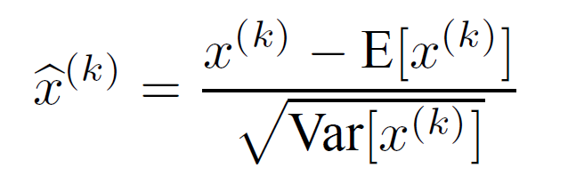
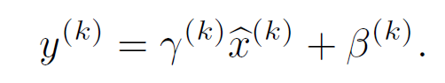
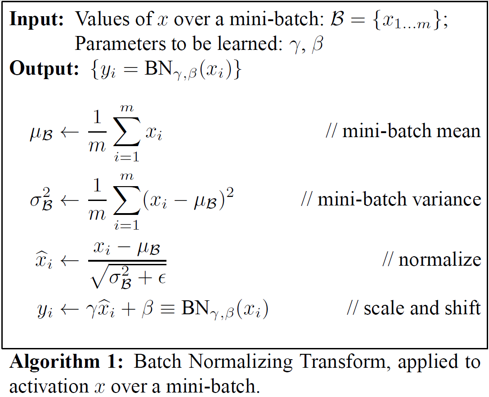

# Batch Normalization: Accelerating Deep Network Training by Reducing Internal Covariate Shift

笔记：codingleee@163.com

在神经网络的训练中，每一层的输入分布都受到该层之前所有参数的影响，输入分布的不断变化会降低模型的训练速度以及性能，这种现象被称为Internal Covariate
Shift(ICS)，通过本文介绍的Batch Normalization可以缓解这一现象，加快学习并提高性能。

## 1. Introduction
在神经网络的训练中，每一层的输入分布都受到该层之前所有参数的影响，因为这一层的参数要不断去适应每一次的新输入分布，因此训练会变得非常缓慢，而且对参数初始化值很敏感。  
The inputs to each layer are affected by the parameters of all preceding layers ? so that small changes to the network parameters amplify as the network becomes deeper.  
The change in the distributions of layers’ inputs presents a problem because the layers need to continuously adapt to the new distribution.

对于一个完整的系统来说，当输入分布发生变化时（即数据集的分布改变），我们说它在经受covariate shift（协变量迁移）。但是对于子网络或者网络的某一层来说，同样有着这样的问题，被称为Internal Covariate Shift（内部协变量迁移）。  
When the input distribution to a learning system changes, it is said to experience covariate shift (Shimodaira, 2000). This is typically handled via domain adaptation (Jiang, 2008). However, the notion of covariate shift can be extended beyond the learning system as a whole, to apply to its parts, such as a sub-network or a layer.

使整体训练更加有效的输入分布属性（例如在训练数据和测试数据之间具有相同的分布）也适用于训练子网，使网络内部的一层或子网络的输入分布保持稳定对训练也使有帮助的。  
Therefore, the input distribution properties that make training more efficient ? such as having the same distribution between the training and test data ? apply to training the sub-network as well.

如果使用sigmoid等激活函数的网络，在激活函数的输入变得很大或者很小时，激活函数的梯度会趋于0，那么这些输入的梯度就会消失。但是输入X受到之前所有参数W,b的影响，因此当参数改变时很有可能就会将X的一些维度带入趋于饱和的区域，不利于学习。  
However, since x is affected by W, b and the parameters of all the layers below, changes to those parameters during training will likely movemany dimensions of x into the saturated regime of the nonlinearity and slow down the convergence.  
If, however, we could ensure that the distribution of nonlinearity inputs remains more stable as the network trains, then the optimizer would be less likely to get stuck in the saturated regime, and the training would accelerate.

此外，BatchNorm可以看作时一种正则化。
Furthermore, batch normalizationregularizes the model and reduces the need for
Dropout.

## 2. Towards Reducing Internal Covariate Shift
第二章的内容比较难理解，对那个例子后面的解释我感觉没怎么明白。  
虽然白化能够提高网络训练的速度，但是对输入的"<b>向量</b>"进行白化会很带来很大的计算量，因为输入的"<b>向量</b>"X以及Normalization要用到的E(X)都是和网络的参数有依赖关系的，想要白化以及正确的更新参数需要计算输入向量的协方差矩阵以及他们关于网络参数的偏导。因此需要找到一种简单的替换方案来进行normalization.
This motivates us to seek an alternative that performs input normalization in a way that is differentiable and does not require the analysis of the entire training set after every parameter update.

## 3. Normalization via Mini-BatchStatistics
通过第二节的分析，我们不直接对一层的输入向量进行白化，而是对"<b>向量</b>"里的每一个"<b>标量</b>"进行独立的正则化。  
Since the full whitening of each layer’s inputs is costly and not everywhere differentiable, we make two necessary simplifications. The first is that instead of whitening the features in layer inputs and outputs jointly, we will normalize each scalar feature independently, by making it have the mean of zero and the variance of 1.

x(k)的上标k表示x的第k维，也就是向量x的第k维对应的标量。

仅仅是对输入进行归一化会影响这一层的表示，因此通过加入两个可训练的参数对归一化后的值进行放缩和偏移。  
Note that simply normalizing each input of a layer may change what the layer can represent.
To address this, we make sure that the transformation inserted in the network can represent the identity transform. To accomplish this, we introduce, for each activation x(k), a pair of parameters γ(k), β(k), which scale and shift the normalized value.

原本计算激活值的均值与方差是根据整个训练集统计出来的，但是在实际操作中并不方便，这里使用简化的方法，使用随机批梯度下降的一批数据来估计每一个激活值的均值和方差。  
Therefore, we make the second simplification: since we use mini-batches in stochastic gradient training, each mini-batch produces estimates of the mean and variance of each activation

之所以能使用小批量，是因为只需对每一维度计算方差，而不需要对向量计算协方差，如果计算协方差矩阵时批数量小于向量维度会得到奇异协方差矩阵。 （需要和第二节结合理解）   
Note that the use of mini batches is enabled by computation of per-dimension variances rather than joint covariances; in the joint case, regularization would be required since the mini-batch size is likely to be smaller than the number of activations being whitened, resulting in singular covariance matrices.

如下图为BN层的算法：

根据批中的所有数据计算出当前激活值的均值和方差，然后对激活值进行正则化，最后加入可学习的缩放（γ）和偏移（β）。

## 3.1 Training and Inference with Batch-Normalized Networks
在训练时我们需要批中的信息，但是在推断时，我们希望输出只依赖于输入（在推断时也没有批的概念了）。
The normalization of activations that depends on the mini-batch allows efficient training, but is neither necessary nor desirable during inference; we want the output to depend only on the input, deterministically.

因此，我们在训练中记录每一个批次中激活值的均值和方差，以他们的移动平均作为推断时的均值和方差。这样在推断时它们就是固定值，BN层也变成了线性变换。
Since the means and variances are fixed during inference, the normalization is simply a linear transform applied to each activation.

## 3.2 Batch-Normalized Convolutional Networks
BN层要放在激活函数之前。  
We add the BN transform immediately before the nonlinearity, by normalizing x = Wu+b

由于BN会减去批的均值，因此在正则化之前的偏差b会被忽略，而BN层的β则会作为替代，因此不需要在BN层之前加入偏差b。  
Note that, since we normalize Wu+b, the bias b can be ignored since its effect will be canceled by the subsequent mean subtraction (the role of the bias is subsumed by β in Alg. 1).

再次注意BN是对X的<b>每个维度独立</b>进行正则化的，也就是对每个激活值进行正则化。  
the BN transform is applied <b>independently</b> to <b>each</b> dimension of x = Wu, with <b>a separate pair</b> of learned parameters γ(k), β(k) <b>per dimension</b>.

对于卷积层来说，一个特征图（feature map）里的激活值是由同一组参数（同一个卷积核）计算得到的，因此根据这个特性，对批中同一位置的特征图内的所有激活值计算均值和方差，再进行正则化，就是以层为单位进行正则化了。
For convolutional layers, we additionally want the normalization to obey the convolutional property – so that different elements of the same feature map, at different locations, are normalized in the same way. To achieve this, we jointly normalize all the activations in a minibatch, over all locations.

同样，一个特征图里的所有激活值共享一对γ(k) 和 β(k)。  
So for a mini-batch of size m and feature maps of size p × q, we use the effective mini-batch of size m′ = |B| = m · p q. We learn a pair of parameters γ(k) and β(k) per feature map, rather than per activation.

### 3.3 Batch Normalization enables higher learning rates & 3.4 Batch Normalization regularizes the model
BN层通过降低前面变量的小变动对当前层的影响，使得训练更加稳定，可以使用更大的学习率，加快学习。
By normalizing activations throughout the network, it prevents small changes to the parameters from amplifying into larger and suboptimal
changes in activations in gradients;

BN层提高了网络的泛化能力，相当于起到了模型正则化的目的，减小过拟合。

## 4. Experiments and 5. Conclusions
第四部分主要是实验，对简单全连接网络在MNIST训练以及Inception网络在IMAGENAT训练，并介绍了加入BN后对网络的一些调整。

第5部分是总结，和之前说的差不多。

 

