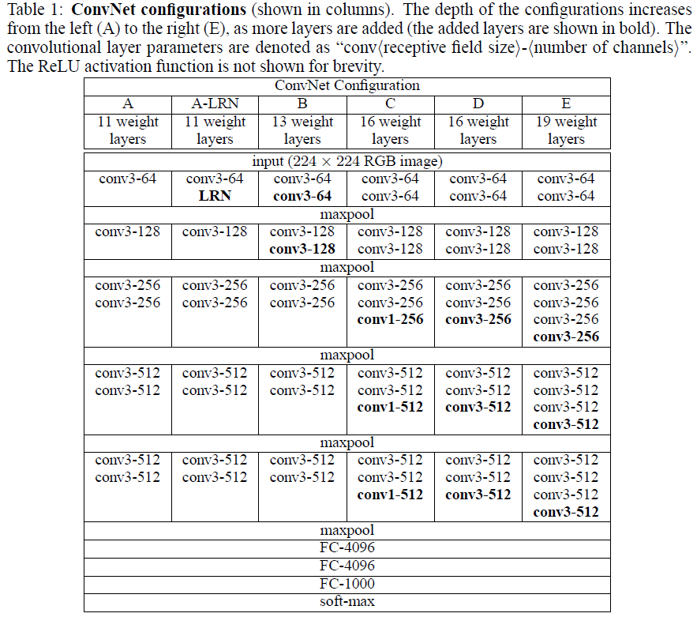

# VERY DEEP CONVOLUTIONAL NETWORKS FOR LARGE-SCALE IMAGE RECOGNITION

笔记：codingleee@163.com

VGG这篇论文主要强调了在卷积网络中深度对模型的影响，在网络中的主要的卷积核尺寸是3*3，通过增加卷积的深度来增加模型的能力。  
Our main contribution is a thorough evaluation of networks of increasing depth using an architecture with very small (3×3) convolution filters, which shows that a significant improvement on the prior-art configurations can be achieved by pushing the depth to 16–19 weight layers.

## 模型架构
- Input size：224×224×3 RGB image 
   
- Conv: Kernel size=3×3(stride=1,padding=1,same), 1×1(stride=1,- padding=0,same)  
  
- Max-pooling: size=2×2, stride=2 
 
- Activation Function: ReLU
  
- The width of conv. layers (the number of channels) is rather small, starting from 64 in the first layer and then increasing by a factor of 2 after each max-pooling layer, until it reaches 512.

上图A到E是使用不同配置的网络结构。

其中LRN是AlexNet里的局部响应归一化，除了A-LRN配置其他都没有使用LRN。

尽管1*1卷积只是对输入输出的线性映射，但是能够多加入一层非线性的ReLU来增加模型的判别能力。
Eventhough in our case the convolution is essentially a linear projection onto the space of the same 1×1 dimensionality (the number of input and output channels is the same), an additional non-linearity is introduced by the rectification function.

## 训练
训练配置：  
The batch size was set to 256, momentum to 0.9. The training was regularised by weight decay (the L2 penalty multiplier set to 5·10−4) and dropout regularisation for the first two fully-connected layers (dropout ratio set to 0.5). The learning rate was initially set to 10−2, and then decreased by a factor of 10 when the validation set accuracy stopped improving.  

在参数初始化的问题上，先训练浅层的配置A网络，然后用网络A的参数去初始化其他配置的网络参数。  
To circumvent this problem, we began with training the configuration A (Table 1), shallow enough to be trained with random initialisation. Then, when training deeper architectures, we initialised the first four convolutional layers and the last three fullyconnected layers with the layers of net A (the intermediate layers were initialised randomly).

关于图片尺寸：  
S是训练图片等比缩放后最小边的尺寸，由于训练图片固定224×224，因此如果S大于224则需要从图片里裁剪出224×224区域。  
Let S be the smallest side of an isotropically-rescaled training image, fromwhich the ConvNet input is cropped (we also refer to S as the training scale).  
在训练过程中分为单尺度训练和多尺度训练：  
- 单尺度训练（single-scale training）:  
  固定S，也就是对于同一张训练图片，在每次训练时它的缩放比例固定，也就是单尺度的意思。在训练中S取值为256和384。  
  In our experiments, we evaluated models trained at two fixed scales: S=256 and S=384.
- 多尺度训练（multi-scale training）：  
  S不固定，每张训练图片随机从一个范围内采样S，然后再裁剪成224×224作为输入，相当于每次训练图片的缩放比例不固定，也就是多尺度的意思。多尺度训练使用S=384的图片进行预训练。
  The second approach to setting S is multi-scale training, where each training image is individually rescaled by randomly sampling S from a certain range [Smin, Smax] (we used Smin = 256 and Smax = 512).   
  For speed reasons, we trained multi-scale models by fine-tuning all layers of a single-scale model with the same configuration, pre-trained with fixed S = 384.

## 测试
在测试时使用密集估计（dense evaluation），将最后3层的全连接网络变成全卷积网络，使模型最后输出的是类得分图（特征图），每张类得分图对应于一个种类，对得分图求平均就是最后的结果。  
对于最后一层卷积（特征图尺寸是7×7，通道数512）和全连接（4096个神经元）之间的参数7×7×512×4096，把他们组合成（7×7×512）×4096，看做是7×7的卷积核，生成了4096个通道的1×1的特征图，这样一来如果输入图片尺寸增大，该卷积层的输入将大于7×7，则这同一组参数（卷积核）会在空间中对输入的不同位置进行相同的计算，这输出的4096个特征图的尺寸也将大于1×1。同理，后面的全连接层与全连接层之间的参数则看做是1×1的卷积核。  
举个例子，假如说输入是225×225，那么最后输出的类得分图（特征图）尺寸是2×2，相当于在原输入的左上、右上、左下、右下以1个像素的间隔裁剪成4个224×224的图片，分别通过网络进行计算，最后输出的结果对应于2×2特征图的左上、右上、左下、右下。
The network is applied densely over the rescaled test image. Namely, the fully-connected layers are first converted to convolutional layers (the first FC layer to a 7 × 7 conv. layer, the last two FC layers to 1 × 1 conv. layers). The resulting fully-convolutional net is then applied to the whole (uncropped) image. The result is a class score map with the number of channels equal to the number of classes, and a variable spatial resolution, dependent on the input image size. Finally, to obtain a fixed-size vector of class scores for the image, the class score map is spatially averaged (sum-pooled).

与通过多次裁剪估计相比（padding=0），密集估计的优点是不需要填充，填充值就是裁剪区域附近的原始图片输入，相当于是增加了感受野；另外一方面密集估计对一张原始图片只需一次输入即可，相当于多个裁剪的并行计算，效率更高。
Also, multi-crop evaluation is complementary to dense evaluation due to different convolution boundary conditions: when applying a ConvNet to a crop, the convolved feature maps are padded with zeros, while in the case of dense evaluation the padding for the same crop naturally comes from the neighbouring parts of an image (due to both the convolutions and spatial pooling), which substantially increases the overall network receptive field, so more context is captured.

最后，在进行估计时，测试图片的尺度Q的选择如下原文中所示。
We begin with evaluating the performance of individual ConvNet models at a single scale with the layer configurations described in Sect. 2.2. The test image size was set as follows: Q = S for fixed S, and Q = 0.5(Smin + Smax) for jittered S ∈ [Smin, Smax].

